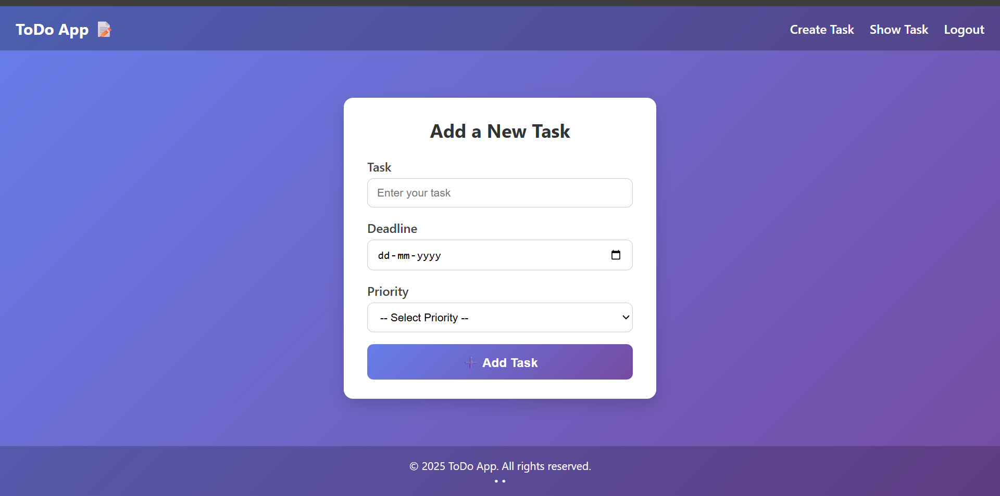
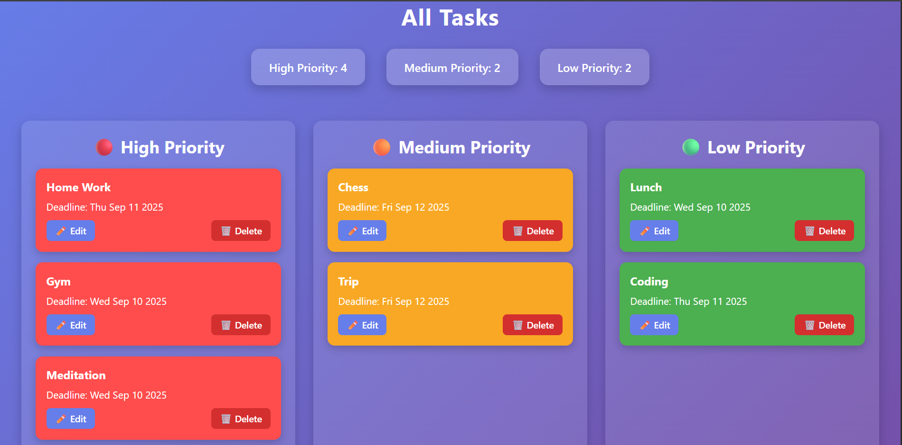

# 📝 Todo App (Node.js + Express + Sequelize + MySQL)

A simple and efficient **Task Management Application** built with  
**Node.js**, **Express.js**, **Sequelize ORM**, and **MySQL**.  

This project demonstrates CRUD operations (Create, Read, Update, Delete) with a structured **MVC architecture**, server-side rendering using **Pug**, and database handling using **Sequelize**.

---

## 🚀 Features
- ➕ Add new tasks with **priority** and **deadline**
- 📃 View all tasks in a clean card-based UI
- ❌ Delete tasks easily
- ⚡ Sequelize ORM for smooth database operations
- 🎨 Pug template engine for server-side rendering
- 🏗️ Follows **MVC architecture**

---

## 🛠️ Tech Stack
- **Backend:** Node.js, Express.js
- **Database:** MySQL
- **ORM:** Sequelize
- **Templating Engine:** Pug
- **Other:** dotenv, body-parser

---

## 📂 Project Structure

```plaintext
project-root/
│── config/              # Database configuration (Sequelize setup)
│   └── database.js
│
│── models/              # Sequelize models
│   └── Todo.js
│
│── controllers/         # Route handlers (business logic)
│   └── todoController.js
│
│── routes/              # Express routes
│   └── todoRoutes.js
│
│── views/               # Pug templates
│   ├── layouts/         # Common layouts (header, footer, base)
│   │   └── layout.pug
│   ├── createTask.pug   # Add Task page
│   └── allTask.pug      # Task listing page
│
│── public/              # Static files
│   ├── css/             # Stylesheets
│   ├── js/              # Client-side scripts
│   └── assets/          # Images (screenshots, logos, etc.)
│
│── .env                 # Environment variables
│── .gitignore           # Ignored files/folders
│── app.js               # Main Express app entry
│── package.json         # Dependencies & scripts

## 🖼️ Screenshots
➕ Add Task Page


### 📌 Add Task Page
 